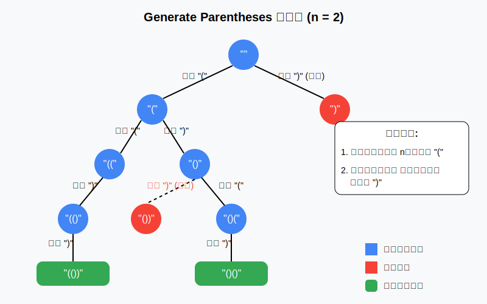

# 1. Original Problem

Given n pairs of parentheses, write a function to generate all combinations of well-formed parentheses.

For example, given n = 3, a solution set is:
```
[
  "((()))",
  "(()())",
  "(())()",
  "()(())",
  "()()()"
]
```

給定 n 對括號，編寫一個函數來生成所有可能的並且有效的括號組合。

例如，給定 n = 3，生成結果為：
```
[
  "((()))",
  "(()())",
  "(())()",
  "()(())",
  "()()()"
]
```

# 2. Problem Understanding

這個問題要求我們生成所有可能的有效括號組合，給定括號對數 n。

核心要求與限制：
- 每個組合必須是有效的括號組合，即每個左括號 '(' 都有一個對應的右括號 ')'，而且右括號必須出現在對應的左括號之後。
- 每個組合的總長度為 2*n（n 個左括號和 n 個右括號）。
- 在任何時刻，右括號的數量不能超過左括號的數量，否則會形成無效組合。

輸入/輸出特性：
- 輸入：一個整數 n，表示括號對數。
- 輸出：包含所有有效括號組合的字串數組。

邊緣情況：
- 如果 n = 0，應該返回空列表。
- 如果 n = 1，應該返回 ["()"]。

主要挑戰：
- 如何系統地生成所有有效組合而不重複。
- 如何確保生成的每個組合都是有效的。
- 如何高效地解決問題，避免生成無效組合。

# 3. Visual Explanation



我們使用決策樹來說明如何系統地構建有效的括號組合。上圖展示了 n = 2 時的決策樹：

- 從空字串 "" 開始
- 在每一步，我們可以添加 '(' 或 ')'，但必須遵循以下規則：
    - 只有在已使用的左括號數量小於 n 時，才能添加左括號
    - 只有在右括號數量小於左括號數量時，才能添加右括號
- 藍色節點表示有效的中間狀態
- 紅色節點表示無效狀態（違反了括號平衡規則）
- 綠色矩形表示有效的最終結果

當我們達到長度為 2*n 的字串時（在這個例子中是長度為 4），如果形成的字串是有效的括號組合，我們就將其添加到結果集中。

# 4. Thought Process

讓我們系統地分析可能的解決方案：

1. **暴力法**：
    - 生成所有可能的長度為 2*n 的 '(' 和 ')' 序列
    - 檢查每個序列是否是有效的括號組合
    - 時間複雜度：O(2^(2n))，非常低效

2. **回溯法**：
    - 遞歸地構建字串，只添加那些導致有效組合的括號
    - 使用兩個計數器跟蹤已使用的左括號和右括號數量
    - 只有在滿足條件時才添加括號
    - 時間複雜度：O(4^n / sqrt(n))，更高效

3. **動態規劃法**：
    - 定義子問題：括號對數為 i 的所有有效組合
    - 利用之前計算的結果構建更大的解
    - 這種方法較為複雜，不如回溯法直觀

回溯法是解決這個問題最自然的方法，原因有：
- 它直接遵循問題的約束條件
- 它避免了生成和檢查無效組合的開銷
- 它系統地探索所有可能的有效組合

回溯法的關鍵思想是：
- 保持對已使用的左右括號數量的追踪
- 只有在不違反有效性規則的情況下，才添加新的括號
- 當達到目標長度時，將構建好的組合添加到結果集中

這種模式在類似的組合生成問題中非常常見，如果能熟練掌握，對解決相關問題將很有幫助。

# 5. Optimal Solution Development

讓我們從簡單情況開始，逐步構建最優解：

**思路分析**：
1. 有效括號組合必須始終保持「平衡」：在任何前綴中，左括號數量 ≥ 右括號數量
2. 當且僅當最終字串中左右括號數量相等（各 n 個）時，組合才是完整的

**遞歸回溯步驟**：
- 我們用 `open` 和 `close` 分別表示已使用的左右括號數量
- 在每一步，我們有兩種可能的選擇：
    - 添加左括號：如果 `open < n`
    - 添加右括號：如果 `close < open`

讓我們追蹤 n = 2 的完整遞歸過程：

```
開始：""，open=0，close=0
1. 添加 "("：current="("，open=1，close=0
   1.1 添加 "("：current="(("，open=2，close=0
       1.1.1 添加 ")"：current="(()"，open=2，close=1
           1.1.1.1 添加 ")"：current="(())"，open=2，close=2
               ✓ 達到目標長度，添加到結果：["(())"]
   1.2 添加 ")"：current="()"，open=1，close=1
       1.2.1 添加 "("：current="()("，open=2，close=1
           1.2.1.1 添加 ")"：current="()()"，open=2，close=2
               ✓ 達到目標長度，添加到結果：["(())", "()()"]
```

這種方法的優勢在於：
- 我們只生成有效的括號組合，不浪費時間在無效組合上
- 我們系統地探索所有可能的組合，確保不漏掉任何一個
- 實現簡潔而高效

回溯法的本質是一種「嘗試並回退」的過程，它在每一步都做出選擇，如果發現不能得到有效解，就撤銷該選擇並嘗試其他選擇。

# 7. Complexity Analysis

**時間複雜度分析**：

- 我們生成的是所有有效括號組合，而有效括號組合的數量是 Catalan 數 C(n)
- Catalan 數的漸近表達式為：C(n) ≈ 4^n / (n^(3/2) * √π)
- 對於每個組合，我們需要 O(n) 的時間來構建字串
- 因此，總時間複雜度為 O(n * 4^n / (n^(3/2))) ≈ O(4^n / sqrt(n))

推導過程：
1. 每個括號組合的長度是 2n
2. 我們需要進行 C(n) 次遞歸調用來生成所有組合
3. 每次遞歸調用需要 O(1) 的時間，但字串連接操作需要 O(n) 的時間
4. 總的時間複雜度是 O(n * C(n))

**空間複雜度分析**：

- 遞歸堆棧的深度最多為 2n（最多進行 2n 次遞歸調用）
- 因此，遞歸堆棧的空間複雜度為 O(n)
- 我們不計入存儲結果所需的空間，因為這是必須輸出的

需要注意的是，在實際應用中，如果 n 較大，生成的組合數量會呈指數級增長，可能會導致內存壓力。

# 8. Optimization & Improvements

現有的回溯解決方案已經相當高效，但仍有一些可能的優化和改進：

**潛在優化**：
1. **預分配結果容量**：基於 Catalan 數預先分配結果切片的容量，減少動態擴容的開銷
   ```go
   // 預分配 Catalan(n) 的空間
   catalanSize := calculateCatalan(n)
   result := make([]string, 0, catalanSize)
   ```

2. **使用 strings.Builder**：對於更大的 n 值，使用 strings.Builder 可能比字串連接更高效
   ```go
   func backtrackWithBuilder(result *[]string, builder *strings.Builder, open, close, max int) {
       if builder.Len() == 2*max {
           *result = append(*result, builder.String())
           return
       }
       
       if open < max {
           builder.WriteByte('(')
           backtrackWithBuilder(result, builder, open+1, close, max)
           builder.Truncate(builder.Len() - 1) // 回溯
       }
       
       // 同理處理右括號...
   }
   ```

**相關問題和延伸學習**：
1. **括號驗證問題**：判斷一個字串是否是有效的括號組合
2. **多種括號匹配問題**：包含多種類型的括號 '(){}[]' 的匹配和生成
3. **Catalan 數問題**：如二叉搜索樹的數量、山峰問題等
4. **其他回溯問題**：如排列組合、子集生成等

**應用場景**：
- 編程語言的語法分析器中的括號匹配檢查
- 表達式計算和解析
- 路徑規劃中的某些問題

這個問題是回溯算法的經典應用，掌握它對解決類似的組合生成問題非常有幫助。

# 9. Testing Strategy

這些測試用例涵蓋了：
- **邊緣情況**：n = 0（空結果）和 n = 1（唯一組合）
- **基本情況**：n = 2 和 n = 3，確認算法能夠正確生成所有有效組合
- **功能驗證**：確保生成的組合數量和內容都符合預期

我們使用 `areEqualSets` 函數來檢查兩個字串集合是否相等，因為不同實現可能以不同順序生成這些組合，但只要最終集合相同，實現就是正確的。
