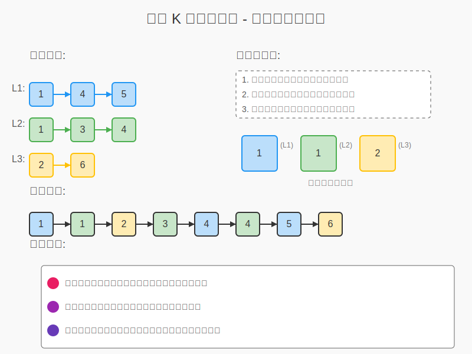
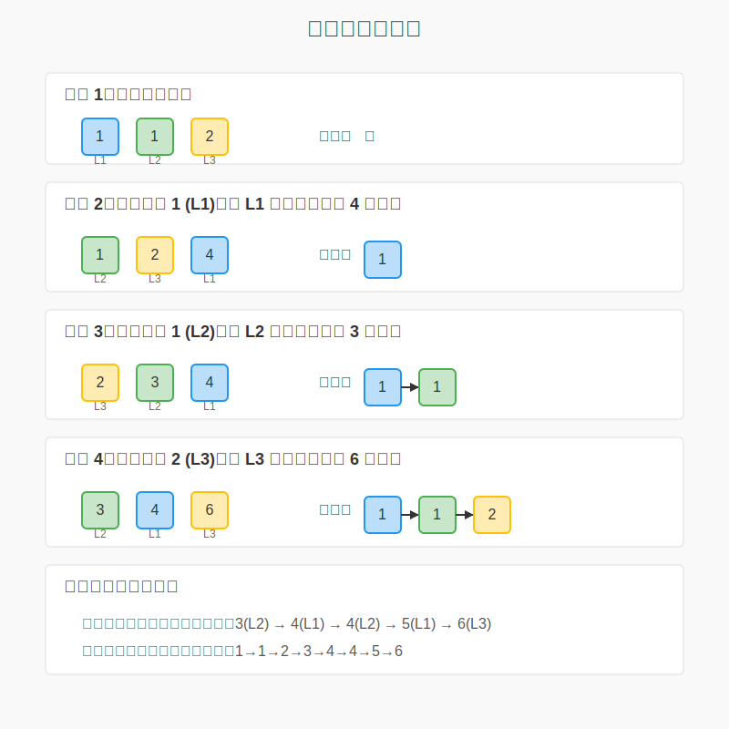

# 1. Original Problem

**Merge k Sorted Lists**

You are given an array of k linked-lists lists, each linked-list is sorted in ascending order.
Merge all the linked-lists into one sorted linked-list and return it.

**合併K個排序鏈表**

給你一個包含 k 個已排序鏈表的數組 lists，每個鏈表都已按升序排列。
請將所有鏈表合併到一個排序鏈表中並返回。

**Example 1:**
```
Input: lists = [[1,4,5],[1,3,4],[2,6]]
Output: [1,1,2,3,4,4,5,6]
Explanation: The linked-lists are:
[
  1->4->5,
  1->3->4,
  2->6
]
merging them into one sorted list:
1->1->2->3->4->4->5->6
```

**Example 2:**
```
Input: lists = []
Output: []
```

**Example 3:**
```
Input: lists = [[]]
Output: []
```

**Constraints:**
- k == lists.length
- 0 <= k <= 10^4
- 0 <= lists[i].length <= 500
- -10^4 <= lists[i][j] <= 10^4
- lists[i] is sorted in ascending order.
- The sum of lists[i].length won't exceed 10^4.

# 2. 問題理解

這個問題要求我們合併 k 個已排序的鏈表，並保持結果鏈表的有序性。讓我們分析一下核心要點：

- **輸入**：k 個已排序（升序）的鏈表數組
- **輸出**：一個合併後的有序鏈表
- **核心要求**：保持元素的順序，將所有元素合併到一個鏈表中
- **約束條件**：
    - 鏈表數量 k 可能高達 10^4
    - 每個鏈表最多有 500 個節點
    - 節點值範圍為 -10^4 到 10^4
    - 所有鏈表的節點總數不超過 10^4

**邊界情況**：
- 空輸入數組（k=0）
- 包含空鏈表的數組
- 只有一個鏈表的數組

**挑戰**：
- 如何高效地從 k 個鏈表中找出當前最小的節點
- 如何處理大量的鏈表（k 很大）時保持算法效率
- 如何優雅處理空鏈表

# 3. 視覺化解釋



上面的圖表展示了使用最小堆方法合併 K 個排序鏈表的過程。通過視覺化，我們可以看到：

1. **輸入數據**：三個已排序的鏈表 L1: 1→4→5, L2: 1→3→4, L3: 2→6
2. **最小堆過程**：
    - 初始化最小堆並插入各鏈表的頭節點：1(L1), 1(L2), 2(L3)
    - 每次從堆中彈出最小元素加入結果鏈表
    - 如果彈出的節點有後繼節點，則將後繼節點加入堆中
3. **合併結果**：最終得到排序鏈表 1→1→2→3→4→4→5→6

讓我們再看看堆操作的具體步驟：



上圖展示了使用最小堆合併 K 個排序鏈表的具體操作步驟：

1. **步驟 1**: 初始化最小堆，將各鏈表頭節點加入堆中：1(L1), 1(L2), 2(L3)
2. **步驟 2**: 彈出最小節點 1(L1)，將其加入結果鏈表，然後將 L1 的下一個節點 4 加入堆
3. **步驟 3**: 彈出最小節點 1(L2)，將其加入結果鏈表，然後將 L2 的下一個節點 3 加入堆
4. **步驟 4**: 彈出最小節點 2(L3)，將其加入結果鏈表，然後將 L3 的下一個節點 6 加入堆
5. **繼續操作**: 依此類推，直到堆為空

這個視覺化過程説明我們理解算法如何在每一步選擇當前最小的節點，並保持結果鏈表的有序性。

# 4. 思路分析

針對合併 K 個排序鏈表的問題，我們可以考慮以下幾種解決方案：

## 方案一：逐一合併

最直觀的思路是兩兩合併鏈表。首先合併前兩個鏈表，然後將結果與第三個鏈表合併，以此類推。

**優點**：
- 實現簡單，利用已有的「合併兩個排序鏈表」算法
- 空間複雜度低，只需要 O(1) 的額外空間

**缺點**：
- 時間複雜度較高：O(k·N)，其中 N 是所有節點的總數，k 是鏈表個數
- 某些鏈表的節點會被重複比較多次

## 方案二：分治法（Divide and Conquer）

將 k 個鏈表分成兩半，分別合併這兩半，然後再將結果合併。這是一種自頂向下的方法。

**優點**：
- 避免了方案一中節點的重複比較
- 時間複雜度為 O(N·log(k))，比方案一更優

**缺點**：
- 實現相對複雜
- 需要遞歸調用，可能導致堆棧開銷

## 方案三：使用最小堆（Min Heap）

使用最小堆來維護當前所有鏈表頭部節點中的最小值。

**優點**：
- 時間複雜度為 O(N·log(k))，與分治法相當
- 實現直觀，容易理解
- 避免了多次合併帶來的開銷

**缺點**：
- 需要額外的 O(k) 空間來維護堆
- 需要自定義節點比較邏輯

## 方案比較與選擇

| 方案 | 時間複雜度 | 空間複雜度 | 實現難度 |
|------|------------|------------|----------|
| 逐一合併 | O(k·N) | O(1) | 簡單 |
| 分治法 | O(N·log(k)) | O(log(k)) | 中等 |
| 最小堆 | O(N·log(k)) | O(k) | 中等 |

考慮到時間效率和實現直觀性，**最小堆**方案是一個較好的選擇。雖然分治法在時間複雜度上與最小堆相當，但最小堆的實現邏輯更直觀，更容易理解和維護。

對於這類問題，我們可以認識到一個模式：當需要從多個有序集合中找出最小/最大元素時，最小/最大堆通常是一個高效的選擇。

# 5. 最優解方案演進

現在讓我們從最基本的方案開始，逐步優化到最優解。

## 5.1 基本方案：逐一合併

首先，我們可以實現一個合併兩個鏈表的函數，然後循環合併所有鏈表：

```go
func mergeTwoLists(l1, l2 *ListNode) *ListNode {
    dummy := &ListNode{}
    curr := dummy
    
    for l1 != nil && l2 != nil {
        if l1.Val < l2.Val {
            curr.Next = l1
            l1 = l1.Next
        } else {
            curr.Next = l2
            l2 = l2.Next
        }
        curr = curr.Next
    }
    
    if l1 != nil {
        curr.Next = l1
    } else {
        curr.Next = l2
    }
    
    return dummy.Next
}

func mergeKLists(lists []*ListNode) *ListNode {
    if len(lists) == 0 {
        return nil
    }
    
    result := lists[0]
    for i := 1; i < len(lists); i++ {
        result = mergeTwoLists(result, lists[i])
    }
    
    return result
}
```

時間複雜度分析：O(k·N)，其中 k 是鏈表數量，N 是所有節點的總數。

## 5.2 優化一：分治法合併

分治法通過遞歸將問題分解成子問題，避免了多次重複合併：

```go
func mergeKLists(lists []*ListNode) *ListNode {
    n := len(lists)
    if n == 0 {
        return nil
    }
    if n == 1 {
        return lists[0]
    }
    
    mid := n / 2
    left := mergeKLists(lists[:mid])
    right := mergeKLists(lists[mid:])
    
    return mergeTwoLists(left, right)
}
```

時間複雜度：O(N·log(k))，其中 k 是鏈表數量，N 是所有節點的總數。

## 5.3 最優解：使用最小堆

最小堆可以高效地找出當前所有鏈表頭部節點中的最小值：

```go
import "container/heap"

type NodeHeap []*ListNode

func (h NodeHeap) Len() int           { return len(h) }
func (h NodeHeap) Less(i, j int) bool { return h[i].Val < h[j].Val }
func (h NodeHeap) Swap(i, j int)      { h[i], h[j] = h[j], h[i] }

func (h *NodeHeap) Push(x interface{}) {
    *h = append(*h, x.(*ListNode))
}

func (h *NodeHeap) Pop() interface{} {
    old := *h
    n := len(old)
    x := old[n-1]
    *h = old[0 : n-1]
    return x
}

func mergeKLists(lists []*ListNode) *ListNode {
    // 創建一個虛擬頭節點，用於構建結果鏈表
    dummy := &ListNode{}
    curr := dummy
    
    // 創建最小堆
    h := &NodeHeap{}
    heap.Init(h)
    
    // 將所有非空鏈表的頭節點加入堆中
    for _, list := range lists {
        if list != nil {
            heap.Push(h, list)
        }
    }
    
    // 不斷從堆中取出最小節點，加入結果鏈表
    for h.Len() > 0 {
        node := heap.Pop(h).(*ListNode)
        curr.Next = node
        curr = curr.Next
        
        // 如果彈出的節點有下一個節點，則將其加入堆中
        if node.Next != nil {
            heap.Push(h, node.Next)
        }
    }
    
    return dummy.Next
}
```

時間複雜度：O(N·log(k))，其中 k 是鏈表數量，N 是所有節點的總數。
空間複雜度：O(k)，用於維護堆。

最小堆方案是最優解，因為：

1. 時間複雜度達到了理論下限 O(N·log(k))
2. 每個節點只需要進出堆一次
3. 實現直觀，易於理解和維護
4. 適合處理大規模輸入和流式處理

這種方案可以有效地處理各種極端情況，如 k 很大但每個鏈表很短，或者 k 很小但每個鏈表很長。

# 7. 複雜度分析

## 時間複雜度

對於最優解（最小堆方案），時間複雜度為 **O(N·log(k))**，其中：
- N 是所有節點的總數
- k 是鏈表的數量

詳細分析：
1. 初始化最小堆：需要將 k 個節點加入堆中，時間複雜度為 O(k)
2. 對於每個節點：
    - 從堆中彈出最小節點：O(log(k))
    - 將下一個節點加入堆：O(log(k))
3. 每個節點最多進出堆一次，總共有 N 個節點，所以整體時間複雜度為 O(N·log(k))

**最佳情況**：當 k=1 時（只有一個鏈表），時間複雜度為 O(N)
**最壞情況**：當 k=N 時（每個鏈表只有一個節點），時間複雜度為 O(N·log(N))

## 空間複雜度

最小堆方案的空間複雜度為 **O(k)**，主要用於維護堆：
- 堆中最多同時存在 k 個節點（每個鏈表最多一個節點在堆中）
- 結果鏈表的空間不計入額外空間

**分析**：
- 輔助空間（堆）：O(k)
- 遞歸調用棧空間：O(1)（非遞歸實現）

與分治法相比，最小堆方案在 k 較大時的空間開銷更大，但實現更為直觀。

# 8. 優化與改進

## 潛在優化方向

1. **預處理優化**：
    - 在將節點加入堆之前，過濾掉空鏈表，減少初始化時的操作

2. **數據結構選擇**：
    - 對於特定場景，可以考慮使用其他數據結構如跳表（Skip List）代替堆

3. **批量處理**：
    - 如果鏈表非常長，可以考慮批量處理，每次從堆中取出多個節點而不是一個

4. **並行處理**：
    - 對於非常大的數據集，可以考慮並行合併鏈表，然後合併結果

## 不同解法比較

| 解法 | 優點 | 缺點 | 適用場景 |
|------|------|------|----------|
| 逐一合併 | 實現簡單，空間效率高 | 時間複雜度高 O(k·N) | k 較小，或資源受限時 |
| 分治法 | 時間複雜度優 O(N·log(k))，較少比較次數 | 遞歸實現稍複雜 | k 較大時，需要優化時間 |
| 最小堆 | 時間複雜度優 O(N·log(k))，實現直觀 | 需要額外 O(k) 空間 | 通用場景，尤其是在線處理 |

## 建議與總結

- 對於大多數情況，最小堆方案是最平衡的選擇
- 如果 k 很小（如 k <= 10），簡單的逐一合併可能更有效率
- 如果內存非常受限，分治法可能更適合，因為它的空間複雜度更低

# 9. 測試策略

我們設計了一套全面的測試策略，確保合併 K 個排序鏈表的算法正確性和性能。測試涵蓋了多種情況，包括：

## 功能測試案例

1. **基本測試** - 測試多個非空鏈表的合併功能
2. **空輸入處理** - 測試空鏈表數組的處理
3. **單個空鏈表** - 測試只有一個空鏈表的情況
4. **多個空鏈表** - 測試所有鏈表都為空的情況
5. **混合空和非空鏈表** - 測試部分鏈表為空的情況
6. **單個鏈表** - 測試只有一個非空鏈表的情況
7. **重複元素** - 測試包含相同元素的鏈表
8. **負數值** - 測試包含負數的情況
9. **長度不同的鏈表** - 測試長度差異大的鏈表
10. **極端值** - 測試包含極端大小值的情況

## 性能測試

1. **基準測試** - 測量算法在標準輸入下的性能
2. **比較不同算法** - 比較最小堆、線性合併和分治法三種方法的性能差異

## 測試設計特點

1. **表驅動測試** - 採用 Go 推薦的表驅動測試方法，提高程式碼可讀性和維護性
2. **輔助函數** - 使用 `buildList` 和 `listToArray` 函數，簡化測試數據的創建和驗證
3. **獨立測試** - 通過深拷貝輸入數據，確保測試案例之間相互獨立
4. **詳細描述** - 每個測試案例都包含了詳細描述，便於理解測試目的
5. **邊界情況覆蓋** - 完整覆蓋了各種可能的邊界情況