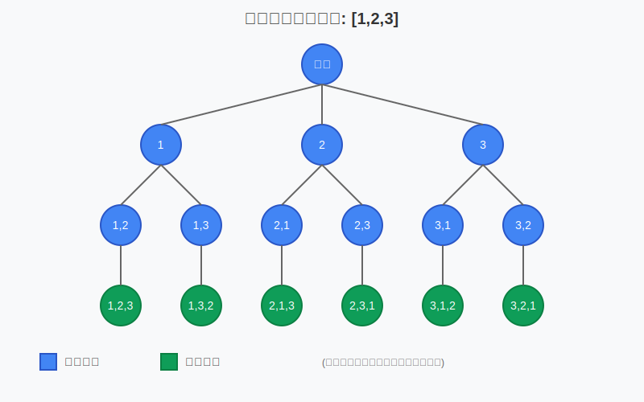

# 1. Original Problem:

## English Version:
**Permutations**

Given an array `nums` of distinct integers, return all possible permutations. You can return the answer in any order.

**Example 1:**
```
Input: nums = [1,2,3]
Output: [[1,2,3],[1,3,2],[2,1,3],[2,3,1],[3,1,2],[3,2,1]]
```

**Example 2:**
```
Input: nums = [0,1]
Output: [[0,1],[1,0]]
```

**Example 3:**
```
Input: nums = [1]
Output: [[1]]
```

**Constraints:**
- 1 <= nums.length <= 6
- -10 <= nums[i] <= 10
- All the integers of nums are unique.

## 繁體中文版本：
**全排列**

給定一個不含重複數字的數組 `nums`，返回其所有可能的全排列。你可以按任意順序返回答案。

**示例 1：**
```
輸入：nums = [1,2,3]
輸出：[[1,2,3],[1,3,2],[2,1,3],[2,3,1],[3,1,2],[3,2,1]]
```

**示例 2：**
```
輸入：nums = [0,1]
輸出：[[0,1],[1,0]]
```

**示例 3：**
```
輸入：nums = [1]
輸出：[[1]]
```

**約束條件：**
- 1 <= nums.length <= 6
- -10 <= nums[i] <= 10
- nums 中的所有整數都是唯一的。

# 2. 初始問題解析與心智建模：

當我們第一次看到這個問題時，首先應該做的是仔細閱讀問題陳述，並提取關鍵信息：

- 我們有一個數組 `nums`，其中包含不重複的整數
- 我們需要找出這些數字的所有可能排列
- 返回的結果可以是任意順序

讓我們看看例子來具體理解問題：
- 例子 1 給了數組 [1,2,3]，輸出是所有可能的排列：[[1,2,3],[1,3,2],[2,1,3],[2,3,1],[3,1,2],[3,2,1]]
- 這正好是 3! = 6 種排列，這符合排列的數學定義

從數學角度看，n 個不同元素的全排列數量是 n!（n 的階乘）。因此，對於輸入 [1,2,3]，我們期望有 3! = 6 種不同的排列。

在心智建模方面，我們可以將這個問題視為：
1. 選擇第一個位置的數字
2. 從剩餘數字中選擇第二個位置的數字
3. 繼續這個過程，直到所有位置都被填滿

這種思維方式將引導我們使用遞歸或回溯法來解決問題。

# 3. 問題理解與核心挑戰：

核心要求是生成所有可能的排列，而主要約束是數組中的所有整數都是唯一的（沒有重複）。

分析輸入/輸出特性：
- 輸入：一個包含不重複整數的數組
- 輸出：一個二維數組，包含所有可能的排列
- 邊界情況：當數組只有一個元素時，只有一種排列

這個問題的本質是一個組合問題，特別是排列問題：給定 n 個不同的元素，找出所有可能的排列方式。

核心挑戰在於：
1. 如何系統地生成所有排列而不遺漏
2. 如何避免重複計算相同的排列
3. 如何高效地構建結果集

# 4. 視覺問題表示：

對於排列問題，我們可以使用決策樹來視覺化問題：

假設輸入為 [1,2,3]，我們可以這樣表示：

```
                   []
           /       |        \
        [1]       [2]       [3]
       /   \     /   \     /   \
    [1,2] [1,3] [2,1] [2,3] [3,1] [3,2]
     |      |     |     |     |     |
  [1,2,3] [1,3,2] [2,1,3] [2,3,1] [3,1,2] [3,2,1]
```

每一層代表我們做出的一個選擇：
- 第一層：選擇第一個位置的數字
- 第二層：選擇第二個位置的數字
- 第三層：選擇第三個位置的數字

這種樹狀結構清晰地表明了所有可能的選擇路徑，每條從根到葉的路徑代表一種可能的排列。

# 5. 問題模式識別：

這是一個典型的「排列」問題，屬於回溯算法（Backtracking）的經典應用。識別這一點的關鍵指標：

1. 我們需要生成所有可能的情況（全排列）
2. 每次決策都會減少後續可用的選項
3. 我們需要探索所有可能的決策路徑

回溯算法是解決這類問題的標準方法，它通過系統地嘗試所有可能性來找到所有解。回溯法的思想是：選擇、探索、撤銷選擇，然後嘗試下一個選擇。

對於排列問題，我們可以使用一個「已使用」標記來跟踪哪些元素已經被放入當前排列中，確保每個元素只被使用一次。

# 6. 策略性問題解決框架：

對於排列問題，我們可以採用以下通用框架：

1. **狀態定義**：使用一個數組來表示當前正在構建的排列，以及一個用於跟踪哪些元素已被使用的集合
2. **決策過程**：
    - 如果當前排列已經達到目標長度，將其添加到結果集
    - 否則，嘗試所有尚未使用的元素：
        - 將元素添加到當前排列
        - 標記元素為已使用
        - 遞歸探索下一個位置
        - 回溯：移除元素，並將其標記為未使用
3. **基本情況**：當排列長度等於輸入數組長度時，我們找到了一個完整排列

這種框架對於類似的問題（如子集、組合）也非常適用，只需根據具體問題調整決策邏輯。

# 7. 編碼前的算法設計：

讓我們設計一個回溯算法來解決這個問題：

```
function permute(nums):
    結果集 = []
    
    function backtrack(路徑, 使用標記):
        如果 路徑長度 == nums長度:
            結果集.添加(路徑的副本)
            返回
        
        對於 i 從 0 到 nums長度-1:
            如果 使用標記[i] == true:
                繼續
            
            路徑.添加(nums[i])
            使用標記[i] = true
            
            backtrack(路徑, 使用標記)
            
            路徑.移除最後一個元素
            使用標記[i] = false
    
    初始化空路徑和使用標記
    backtrack(路徑, 使用標記)
    返回結果集
```

這個算法使用回溯技術來系統地生成所有可能的排列。我們使用一個數組來記錄當前路徑（正在構建的排列），並使用一個布爾數組來標記哪些元素已經被使用。

# 8. 視覺解釋：

讓我們通過視覺化示例說明算法的執行過程。以 `nums = [1, 2, 3]` 為例：

```
初始狀態：
路徑 = []
使用標記 = [false, false, false]

第一層遞歸（選擇第一個數字）：
  選擇 1：
    路徑 = [1]
    使用標記 = [true, false, false]
    
    第二層遞歸（選擇第二個數字）：
      選擇 2：
        路徑 = [1, 2]
        使用標記 = [true, true, false]
        
        第三層遞歸（選擇第三個數字）：
          選擇 3：
            路徑 = [1, 2, 3]
            使用標記 = [true, true, true]
            添加到結果：[[1, 2, 3]]
          回溯：路徑 = [1, 2], 使用標記 = [true, true, false]
        
      回溯：路徑 = [1], 使用標記 = [true, false, false]
      
      選擇 3：
        路徑 = [1, 3]
        使用標記 = [true, false, true]
        
        第三層遞歸（選擇第二個數字）：
          選擇 2：
            路徑 = [1, 3, 2]
            使用標記 = [true, true, true]
            添加到結果：[[1, 2, 3], [1, 3, 2]]
          回溯：路徑 = [1, 3], 使用標記 = [true, false, true]
        
      回溯：路徑 = [1], 使用標記 = [true, false, false]
    
    回溯：路徑 = [], 使用標記 = [false, false, false]
```

這個過程會繼續，直到所有排列都被探索。最終的結果會包含所有 6 種可能的排列。

# 9. 解決方案發展歷程：

讓我們從直覺的解決方案開始，然後逐步優化：

**1. 暴力解法（遞歸枚舉）**：
我們可以嘗試所有可能的排列方式，但這個方法效率非常低，因為我們需要嘗試 n! 種可能性。

**2. 回溯法**：
通過系統化地探索所有可能性，回溯法是解決這類問題的標準方法。我們維護一個「使用標記」來避免重複使用元素。

**3. 優化的回溯法**：
我們可以通過直接在原始數組上交換元素來實現回溯，這樣可以減少額外的空間使用。

**4. 迭代方法**：
可以使用「字典序法」或「下一個排列」算法來迭代生成所有排列，但這種方法往往比回溯法更難理解。

對於這個問題，回溯法是最直觀和高效的解決方案。雖然時間複雜度仍然是 O(n!)，但這是不可避免的，因為我們需要生成所有 n! 種排列。

# 10. 實際案例演示：

讓我們以 `nums = [1, 2, 3]` 為例，詳細追蹤回溯算法的執行過程：

**步驟 1**：初始化
```
結果集 = []
路徑 = []
使用標記 = [false, false, false]
```

**步驟 2**：開始回溯（第一層）
選擇 nums[0] = 1:
```
路徑 = [1]
使用標記 = [true, false, false]
```

**步驟 3**：繼續回溯（第二層）
選擇 nums[1] = 2:
```
路徑 = [1, 2]
使用標記 = [true, true, false]
```

**步驟 4**：繼續回溯（第三層）
選擇 nums[2] = 3:
```
路徑 = [1, 2, 3]
使用標記 = [true, true, true]
```
路徑長度等於 nums 長度，添加到結果集：`結果集 = [[1, 2, 3]]`

**步驟 5**：回溯到第二層
```
路徑 = [1, 2]
使用標記 = [true, true, false]
```
沒有更多未使用的元素，完成對 nums[1] 的探索。

**步驟 6**：回溯到第一層
```
路徑 = [1]
使用標記 = [true, false, false]
```

**步驟 7**：選擇 nums[2] = 3（第二層）
```
路徑 = [1, 3]
使用標記 = [true, false, true]
```

**步驟 8**：選擇 nums[1] = 2（第三層）
```
路徑 = [1, 3, 2]
使用標記 = [true, true, true]
```
添加到結果集：`結果集 = [[1, 2, 3], [1, 3, 2]]`

這個過程會繼續，直到所有排列都被探索。最終結果是：
```
結果集 = [[1, 2, 3], [1, 3, 2], [2, 1, 3], [2, 3, 1], [3, 1, 2], [3, 2, 1]]
```

# 11. Golang 實現：

```go
func permute(nums []int) [][]int {
    // 結果集
    result := [][]int{}
    
    // 定義回溯函數
    var backtrack func(path []int, used []bool)
    backtrack = func(path []int, used []bool) {
        // 如果路徑長度等於 nums 的長度，表示找到了一個完整的排列
        if len(path) == len(nums) {
            // 創建一個 path 的副本，並添加到結果集中
            pathCopy := make([]int, len(path))
            copy(pathCopy, path)
            result = append(result, pathCopy)
            return
        }
        
        // 嘗試在當前位置放置每個未使用的數字
        for i := 0; i < len(nums); i++ {
            // 如果數字已使用，則跳過
            if used[i] {
                continue
            }
            
            // 選擇當前數字
            path = append(path, nums[i])
            used[i] = true
            
            // 遞歸探索下一個位置
            backtrack(path, used)
            
            // 回溯：移除當前數字，標記為未使用
            path = path[:len(path)-1]
            used[i] = false
        }
    }
    
    // 初始化並啟動回溯過程
    path := []int{}
    used := make([]bool, len(nums))
    backtrack(path, used)
    
    return result
}
```

這個 Golang 實現使用了標準的回溯算法模式，遵循先選擇、後回溯的原則。我們使用一個布爾數組 `used` 來跟踪哪些元素已經被使用，使用一個切片 `path` 來構建當前的排列。

# 12. 實現執行演示：

讓我們使用 `nums = [1, 2, 3]` 來演示代碼的執行過程：

1. 初始化：
   ```
   result = []
   path = []
   used = [false, false, false]
   ```

2. 調用 `backtrack(path, used)`：
    - 檢查：`len(path) == len(nums)`? 否
    - 開始循環 i = 0
    - 檢查：`used[0]`? 否
    - 選擇 nums[0]：
      ```
      path = [1]
      used = [true, false, false]
      ```
    - 遞歸調用 `backtrack(path, used)`

3. 在第二層遞歸中：
    - 檢查：`len(path) == len(nums)`? 否
    - 開始循環 i = 0
    - 檢查：`used[0]`? 是，跳過
    - 檢查：`used[1]`? 否
    - 選擇 nums[1]：
      ```
      path = [1, 2]
      used = [true, true, false]
      ```
    - 遞歸調用 `backtrack(path, used)`

4. 在第三層遞歸中：
    - 檢查：`len(path) == len(nums)`? 否
    - 開始循環 i = 0, 1, 2
    - 檢查：`used[0]`, `used[1]`? 是，跳過
    - 檢查：`used[2]`? 否
    - 選擇 nums[2]：
      ```
      path = [1, 2, 3]
      used = [true, true, true]
      ```
    - 遞歸調用 `backtrack(path, used)`

5. 在第四層遞歸中：
    - 檢查：`len(path) == len(nums)`? 是
    - 創建 pathCopy = [1, 2, 3]
    - 添加到結果：`result = [[1, 2, 3]]`
    - 返回

6. 回到第三層，回溯：
   ```
   path = [1, 2]
   used = [true, true, false]
   ```

7. 對於 i = 2，已嘗試，循環結束，返回到第二層

繼續這個過程，直到探索完所有排列。

# 13. 複雜度分析：

**時間複雜度**：
- 對於長度為 n 的輸入數組，我們需要生成 n! 個排列。
- 在每個遞歸層級，我們需要嘗試最多 n 個選擇。
- 對於每個找到的排列，我們需要 O(n) 時間複製結果。
- 總體時間複雜度為 O(n * n!)。

**空間複雜度**：
- 遞歸調用棧的深度為 O(n)。
- 我們使用了一個大小為 n 的布爾數組來跟踪已使用的元素。
- 存儲結果需要 O(n * n!) 的空間。
- 不考慮輸出存儲，空間複雜度為 O(n)。
- 考慮輸出存儲，空間複雜度為 O(n * n!)。

時間複雜度不能進一步優化，因為生成所有 n! 個排列本身就需要 O(n!) 的時間。

# 14. 優化與改進：

我們的解決方案已經很高效，但還可以考慮一些改進：

1. **使用交換而非標記**：
   我們可以通過在原數組上直接交換元素來實現回溯，這樣可以避免使用額外的「使用標記」數組，但會修改原數組。

```go
func permute(nums []int) [][]int {
    result := [][]int{}
    
    var backtrack func(start int)
    backtrack = func(start int) {
        if start == len(nums) {
            numsCopy := make([]int, len(nums))
            copy(numsCopy, nums)
            result = append(result, numsCopy)
            return
        }
        
        for i := start; i < len(nums); i++ {
            // 交換 nums[start] 和 nums[i]
            nums[start], nums[i] = nums[i], nums[start]
            
            // 遞歸
            backtrack(start + 1)
            
            // 回溯：交換回來
            nums[start], nums[i] = nums[i], nums[start]
        }
    }
    
    backtrack(0)
    return result
}
```

2. **迭代方法（字典序算法）**：
   對於一些特定場景，可以使用「下一個排列」算法來迭代地生成所有排列，但複雜度仍然是 O(n!)。

3. **並行計算**：
   對於大型問題，可以考慮將排列生成任務分配給多個 goroutine 來並行計算。

# 15. 一般問題解決智慧：

從這個問題中，我們可以學到的核心經驗：

1. **系統化探索**：回溯法是一種系統、有條理地探索所有可能性的強大技術。
2. **狀態跟踪**：在回溯過程中，正確跟踪和恢復狀態是關鍵。
3. **決策樹思維**：將問題視覺化為決策樹有助於理解問題結構和解決方案。
4. **遞歸與迭代**：許多組合問題可以用遞歸或迭代方式解決，選擇適合的方法很重要。

這些技術不僅適用於排列問題，還適用於許多其他組合問題，如子集生成、組合生成、路徑探索等。

# 16. 測試策略：

這個測試用例涵蓋了：
- 基本功能測試（空數組、單個元素、兩個元素等）
- 邊界情況（包含負數）
- 性能測試（較大的輸入）

通過這種表驅動的測試方法，我們可以系統地驗證解決方案的正確性和健壯性。

以上是關於「排列」問題的全面解析。我們從問題定義開始，一步步深入理解問題的本質，設計算法，實現代碼，並分析了複雜度。你可以看到回溯算法是如何系統地生成所有可能的排列，而不遺漏任何一種可能性。

1. 排列問題的決策樹視覺化 - 展示了如何以樹狀結構表示排列生成的過程 

這個問題的核心在於理解回溯法的基本原理：做選擇、探索、撤銷選擇的迭代過程。掌握了這個模式後，你不僅能解決排列問題，還能應用於其他類似的組合問題。
