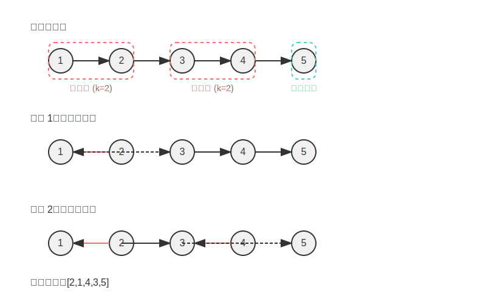

# 1. Original Problem: Reverse Nodes in k-Group

## English
Given the `head` of a linked list, reverse the nodes of the list `k` at a time, and return the modified list.

`k` is a positive integer and is less than or equal to the length of the linked list. If the number of nodes is not a multiple of `k` then left-out nodes, in the end, should remain as it is.

You may not alter the values in the list's nodes, only nodes themselves may be changed.

### Examples:
**Example 1:**
```
Input: head = [1,2,3,4,5], k = 2
Output: [2,1,4,3,5]
```

**Example 2:**
```
Input: head = [1,2,3,4,5], k = 3
Output: [3,2,1,4,5]
```

### Constraints:
- The number of nodes in the list is `n`
- `1 <= k <= n <= 5000`
- `0 <= Node.val <= 1000`

## 繁體中文
給你一個鏈表的頭節點 `head`，每 `k` 個節點一組進行翻轉，請你返回修改後的鏈表。

`k` 是一個正整數，它的值小於或等於鏈表的長度。如果節點總數不是 `k` 的整數倍，那麼請將最後剩餘的節點保持原有順序。

你不能更改節點中的值，只能更改節點本身。

### 範例：
**範例 1：**
```
輸入：head = [1,2,3,4,5], k = 2
輸出：[2,1,4,3,5]
```

**範例 2：**
```
輸入：head = [1,2,3,4,5], k = 3
輸出：[3,2,1,4,5]
```

### 約束條件：
- 鏈表中的節點數量為 `n`
- `1 <= k <= n <= 5000`
- `0 <= Node.val <= 1000`

# 2. 問題理解

## 核心要求與約束
- 我們需要將一個鏈表按照每 k 個節點一組進行翻轉
- 如果最後剩餘的節點數量少於 k，則不進行翻轉
- 我們只能改變節點的指針，不能修改節點的值
- k 的值是一個正整數，且不超過鏈表的長度

## 輸入/輸出特性
- 輸入：鏈表頭節點與整數 k
- 輸出：翻轉後的鏈表頭節點
- 特殊情況：
    - 當 k = 1 時，鏈表保持不變
    - 當鏈表長度為 1 時，無論 k 值為何，結果都不變

## 潛在難點
1. 需要精確識別每 k 個節點的邊界
2. 翻轉鏈表的同時，需要保持與前一組和後一組的連接關係
3. 處理最後一組不足 k 個節點的情況
4. 鏈表操作需要小心處理指針，避免丟失節點或造成環形鏈表

# 3. 視覺化解釋



讓我們以範例 1 進行視覺化說明：`head = [1,2,3,4,5], k = 2`

現在讓我來進一步說明上面的圖示：

1. **原始鏈表**：我們有一個包含 5 個節點的鏈表 `[1,2,3,4,5]`，每個節點以圓圈表示，節點之間的箭頭表示指針。

2. **分組**：因為 k=2，所以我們將鏈表分為三組：
    - 第一組：節點 1 和 2（紅色虛線框）
    - 第二組：節點 3 和 4（紅色虛線框）
    - 剩餘節點：節點 5（青色虛線框，少於 k 個節點不需翻轉）

3. **步驟 1**：翻轉第一組，使節點 2 指向節點 1，節點 1 指向節點 3
    - 翻轉後：`2->1->3->4->5`

4. **步驟 2**：翻轉第二組，使節點 4 指向節點 3，節點 3 指向節點 5
    - 翻轉後：`2->1->4->3->5`

最終結果是 `[2,1,4,3,5]`，與預期輸出一致。

對於第二個範例 `head = [1,2,3,4,5], k = 3`，我們類似地進行分組：
- 第一組：節點 1、2 和 3（需要翻轉為 3->2->1）
- 剩餘節點：節點 4 和 5（少於 k 個節點，保持原序）

最終結果為 `[3,2,1,4,5]`。

# 4. 思考過程

## 解題思路探討

針對這個問題，我們可以考慮以下幾種解決方案：

### 方案一：迭代法（兩次遍歷）
1. 第一次遍歷確定鏈表的長度
2. 第二次遍歷，每 k 個節點為一組進行翻轉
3. 處理剩餘不足 k 個的節點，保持原順序

這種方法簡單直觀，但需要兩次遍歷鏈表。

### 方案二：迭代法（一次遍歷）
1. 使用計數器，每次計數到 k 時進行一次翻轉
2. 維護前一組的尾節點，以便與當前組的頭節點連接
3. 處理剩餘不足 k 個的節點

這種方法只需一次遍歷，效率更高。

### 方案三：遞迴法
1. 遞迴地處理每一組 k 個節點
2. 當剩餘節點少於 k 個時，終止遞迴並返回
3. 遞迴返回後，將各組連接起來

遞迴方法實現簡潔，但在大型鏈表上可能導致棧溢出。

## 不同方案分析

- **迭代法（兩次遍歷）**：實現簡單，但效率較低，時間複雜度 O(2n)≈O(n)
- **迭代法（一次遍歷）**：效率最高，時間複雜度 O(n)，但需要更多指針操作
- **遞迴法**：代碼簡潔，易於理解，但空間複雜度為 O(n/k) 用於遞迴棧

考慮到效率與實現難度的平衡，我推薦使用**迭代法（一次遍歷）**作為最佳解決方案。

## 識別類似問題模式

這類問題屬於鏈表操作的高級問題，關鍵在於：
1. 識別分組邊界
2. 熟練掌握鏈表翻轉技巧
3. 正確處理分組間的連接

類似的問題還有：
- 翻轉鏈表的特定部分
- 交換相鄰節點
- 按特定規則重組鏈表

這些問題的共同點是需要精準操作指針，並且要特別注意邊界條件和連接處理。

# 5. 最佳解決方案開發

我們將採用迭代法（一次遍歷）作為最佳解決方案。讓我們一步步發展這個方案。

## 初始方案：簡單翻轉

首先，我們需要一個函數來翻轉一段連續的 k 個節點：

```go
func reverseKNodes(head *ListNode, k int) (*ListNode, *ListNode) {
    var prev *ListNode
    current := head
    for i := 0; i < k && current != nil; i++ {
        next := current.Next
        current.Next = prev
        prev = current
        current = next
    }
    // 返回翻轉後的頭和尾
    return prev, head
}
```

然後，我們需要使用一個哨兵節點來簡化邊界情況的處理，並迭代地翻轉每一組 k 個節點：

## 優化方案：使用哨兵節點

```go
func reverseKGroup(head *ListNode, k int) *ListNode {
    // 創建哨兵節點
    dummy := &ListNode{Next: head}
    prevGroupEnd := dummy
    
    for {
        // 檢查剩餘節點是否足夠 k 個
        count := 0
        current := prevGroupEnd.Next
        for count < k && current != nil {
            current = current.Next
            count++
        }
        
        // 如果不足 k 個節點，則退出循環
        if count < k {
            break
        }
        
        // 翻轉當前組的 k 個節點
        groupStart := prevGroupEnd.Next
        groupEnd := groupStart
        prev := current // current 現在指向下一組的開始
        
        current = groupStart
        for i := 0; i < k; i++ {
            next := current.Next
            current.Next = prev
            prev = current
            current = next
        }
        
        // 連接前一組的尾和當前組的頭
        prevGroupEnd.Next = prev
        // 更新 prevGroupEnd 為當前組的尾
        prevGroupEnd = groupEnd
    }
    
    return dummy.Next
}
```

## 進一步優化：代碼重構

為了使代碼更清晰，我們將翻轉邏輯抽象為一個單獨的函數：

```go
func reverseKGroup(head *ListNode, k int) *ListNode {
    dummy := &ListNode{Next: head}
    prevGroupEnd := dummy
    
    for {
        // 檢查是否有 k 個節點
        kth := getKth(prevGroupEnd, k)
        if kth == nil {
            break
        }
        
        // 保存當前組的開始節點和下一組的開始節點
        groupStart := prevGroupEnd.Next
        nextGroupStart := kth.Next
        
        // 翻轉當前組
        reverseList(groupStart, nextGroupStart)
        
        // 調整連接
        prevGroupEnd.Next = kth
        groupStart.Next = nextGroupStart
        
        // 更新 prevGroupEnd 為下一組的前一個節點
        prevGroupEnd = groupStart
    }
    
    return dummy.Next
}

// 獲取第 k 個節點
func getKth(current *ListNode, k int) *ListNode {
    for i := 0; i < k && current != nil; i++ {
        current = current.Next
    }
    return current
}

// 翻轉從 start 到 end（不包括 end）的節點
func reverseList(start, end *ListNode) {
    prev := end
    current := start
    for current != end {
        next := current.Next
        current.Next = prev
        prev = current
        current = next
    }
}
```

這個最終解決方案有以下優點：
1. 使用哨兵節點簡化了邊界情況處理
2. 抽象出獨立的函數使代碼更模塊化
3. 僅需一次遍歷即可完成反轉操作
4. 清晰地處理了各組節點間的連接

我們以範例 `[1,2,3,4,5]` 和 `k=2` 逐步說明執行過程：

1. 初始狀態：`dummy -> 1 -> 2 -> 3 -> 4 -> 5`，`prevGroupEnd = dummy`
2. 找到第 2 個節點（`kth = 2`）
3. `groupStart = 1`，`nextGroupStart = 3`
4. 翻轉 `1 -> 2` 變為 `2 -> 1`
5. 連接：`dummy -> 2 -> 1 -> 3 -> 4 -> 5`，`prevGroupEnd = 1`
6. 找到第 2 個節點（從 1 開始，`kth = 4`）
7. `groupStart = 3`，`nextGroupStart = 5`
8. 翻轉 `3 -> 4` 變為 `4 -> 3`
9. 連接：`dummy -> 2 -> 1 -> 4 -> 3 -> 5`，`prevGroupEnd = 3`
10. 找到第 2 個節點（從 3 開始，`kth = nil`，不足 k 個）
11. 結束循環，返回 `dummy.Next = 2`

最終結果：`2 -> 1 -> 4 -> 3 -> 5`

# 7. 複雜度分析

## 時間複雜度
- **最佳情況**：O(n)，其中 n 為鏈表的長度。我們需要遍歷整個鏈表一次，對於每個節點進行常數時間的操作。
- **平均情況**：O(n)，同上。
- **最壞情況**：O(n)，即使在最壞情況下（例如 k=1 或 k=n），我們仍然只需要遍歷一次。

具體分析：
1. `getKth` 函數需要 O(k) 時間
2. `reverseList` 函數需要 O(k) 時間
3. 我們將鏈表分為 n/k 組，每組執行上述兩個函數
4. 總時間複雜度為 O(n/k × (k+k)) = O(n/k × 2k) = O(2n) = O(n)

## 空間複雜度
- **空間複雜度**：O(1)，我們只使用了常數個額外變數，不管輸入規模如何，空間使用量不變。

主要使用的額外空間：
1. `dummy` 哨兵節點：1 個節點
2. 各種指針（`prevGroupEnd`, `kth`, `groupStart`, `nextGroupStart`, `prev`, `current`, `next`）：常數個

由於這些變數的數量不依賴於輸入大小，所以空間複雜度為 O(1)。

# 8. 優化與改進

## 潛在優化方向

1. **遞迴解法**：對於某些情況，遞迴解法可能更直觀，雖然可能增加空間複雜度。

```go
func reverseKGroup(head *ListNode, k int) *ListNode {
    // 計數當前組的節點數
    count := 0
    current := head
    
    // 檢查是否有 k 個節點
    for count < k && current != nil {
        current = current.Next
        count++
    }
    
    // 如果有 k 個節點，則進行翻轉
    if count == k {
        // 遞迴處理後續節點
        nextHead := reverseKGroup(current, k)
        
        // 翻轉當前組
        prev := nextHead
        current = head
        for i := 0; i < k; i++ {
            next := current.Next
            current.Next = prev
            prev = current
            current = next
        }
        
        return prev  // 返回翻轉後的頭節點
    }
    
    // 不足 k 個節點，直接返回
    return head
}
```

2. **使用棧**：使用棧來暫存 k 個節點，然後彈出時重新連接，這樣可以避免直接操作指針的複雜性。

## 不同解法的優缺點比較

| 解法 | 優點 | 缺點 |
|------|------|------|
| 迭代（一次遍歷） | 時間和空間複雜度最優 | 指針操作複雜 |
| 遞迴 | 代碼簡潔，容易理解 | 空間複雜度 O(n/k)，可能棧溢出 |
| 使用棧 | 避免複雜的指針操作 | 額外空間複雜度 O(k) |

## 建議學習方向
1. **鏈表操作基礎**：熟練掌握單鏈表的基本操作，如遍歷、插入、刪除和翻轉。
2. **指針操作技巧**：練習使用多指針（如快慢指針、前後指針）解決問題。
3. **邊界條件處理**：關注鏈表操作中的邊界條件，如空鏈表、只有一個節點等情況。

相關推薦題目：
- LeetCode 206: 反轉鏈表（基礎）
- LeetCode 92: 反轉鏈表 II（中等）
- LeetCode 143: 重排鏈表（中等）
- LeetCode 148: 排序鏈表（中等）

# 9. 測試策略

這個測試策略涵蓋了以下情況：
1. **基本測試用例**：LeetCode 提供的示例
2. **邊界情況**：
    - 空鏈表
    - 只有一個節點的鏈表
    - k=1（不需翻轉）
    - k 等於鏈表長度
    - k 大於鏈表長度
3. **功能測試**：
    - 大型鏈表，測試多組翻轉

這些測試用例共同確保了我們的解決方案在各種情況下都能正確工作，包括基本功能、邊界情況和特殊情況。

# 總結

我們已經全面分析了 "Reverse Nodes in k-Group" 這道問題，從問題理解到最終實現和測試。這是一個經典的鏈表操作問題，需要精確的指針操作和邊界條件處理。

關鍵點回顧：
1. 使用哨兵節點簡化了頭節點的處理
2. 將問題拆分為識別 k 個節點和翻轉這兩個子問題
3. 注意保持各組之間的正確連接
4. 處理最後不足 k 個節點的情況

這道題目是鏈表進階操作的良好練習，掌握了這類問題的解決思路，對於其他鏈表相關的複雜問題也會有很大幫助。

通過迭代法（一次遍歷）解決方案，我們達到了 O(n) 的時間複雜度和 O(1) 的空間複雜度，這是此類問題的最優解。