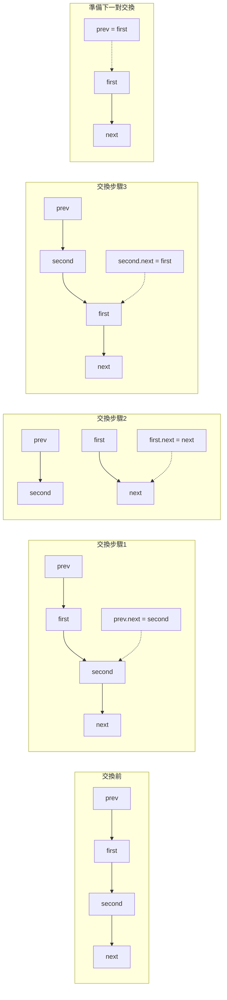

# Swap Nodes in Pairs - LeetCode Problem Solution

## 1. Original Problem

### English
Given a linked list, swap every two adjacent nodes and return its head. You must solve the problem without modifying the values in the list's nodes (i.e., only nodes themselves may be changed.)

**Example 1:**
```
Input: head = [1,2,3,4]
Output: [2,1,4,3]
```

**Example 2:**
```
Input: head = []
Output: []
```

**Example 3:**
```
Input: head = [1]
Output: [1]
```

**Constraints:**
- The number of nodes in the list is in the range [0, 100].
- 0 <= Node.val <= 100

### 繁體中文
給定一個鏈表，兩兩交換其中相鄰的節點，並返回交換後的鏈表的頭節點。你必須在不修改節點內部值的情況下解決這個問題（即，只能更改節點本身）。

**示例 1：**
```
輸入：head = [1,2,3,4]
輸出：[2,1,4,3]
```

**示例 2：**
```
輸入：head = []
輸出：[]
```

**示例 3：**
```
輸入：head = [1]
輸出：[1]
```

**約束條件：**
- 鏈表中的節點數量範圍是 [0, 100]
- 0 <= 節點值 <= 100

## 2. 問題理解

### 核心要求和約束
- 我們需要將鏈表中相鄰的兩個節點進行交換
- 節點交換必須成對進行，即第一和第二個節點交換，第三和第四個節點交換，依此類推
- 不允許修改節點的值，只能修改節點之間的連接關係
- 鏈表可能為空，或只有一個節點，或有偶數或奇數個節點

### 輸入/輸出特性和邊界情況
- 輸入是一個鏈表的頭節點
- 輸出是交換後的鏈表的頭節點
- 邊界情況包括：
    - 空鏈表：直接返回 `nil`
    - 只有一個節點：無需交換，直接返回原頭節點
    - 奇數個節點：最後一個節點保持不變

### 潛在難點和挑戰
- 正確處理節點之間的連接關係，避免鏈表斷裂
- 處理頭節點的變化（因為交換後，第二個節點將成為新的頭節點）
- 在遍歷過程中保持正確的指針位置，確保所有節點都被正確處理

## 3. 視覺解釋

讓我們通過一個例子來說明這個問題：

原始鏈表：
```
1 -> 2 -> 3 -> 4 -> NULL
```

步驟一：交換第一對節點（1和2）
```
2 -> 1 -> 3 -> 4 -> NULL
```

步驟二：交換第二對節點（3和4）
```
2 -> 1 -> 4 -> 3 -> NULL
```

最終結果：
```
2 -> 1 -> 4 -> 3 -> NULL
```

讓我們看一下算法的流程圖：

讓我們更詳細地看一下節點交換的具體操作：




## 4. 思考過程

對於鏈表問題，我們通常有幾種常見的解決方案策略：

### 策略1：遞迴方法
遞迴方法的思路是：
1. 定義遞迴函數，該函數接收當前頭節點，並返回交換後的新頭節點
2. 基本情況：如果頭節點為空或只有一個節點，則直接返回
3. 將頭節點與第二個節點交換
4. 對剩餘的鏈表遞迴調用此函數
5. 連接交換後的部分

### 策略2：迭代方法
迭代方法的思路是：
1. 創建一個啞節點（dummy node），其 next 指向原頭節點
2. 維護一個 prev 指針，初始指向啞節點
3. 在循環中，每次處理 prev 後面的兩個節點（如果存在）
4. 完成交換後，移動 prev 指針，準備處理下一對節點
5. 返回啞節點的 next 作為新的頭節點

### 分析不同角度
- 遞迴方法：程式碼簡潔，但可能導致額外的空間複雜度（由於函數調用棧）
- 迭代方法：實現較為直接，且空間複雜度更優

針對這個問題，迭代方法通常更為適合，因為：
1. 操作更加直觀，容易理解和實現
2. 空間複雜度為 O(1)，而遞迴方法的空間複雜度為 O(n/2) = O(n)
3. 對於長鏈表，避免了潛在的棧溢出風險

在實際解決類似鏈表交換或修改問題時，創建啞節點是一個很好的策略，它可以統一處理頭節點和其他節點，簡化算法邏輯。

## 5. 最優解決方案開發

讓我們從簡單的方法開始，逐步優化到最優解。

### 初步解決方案：遞迴方法

```go
func swapPairs(head *ListNode) *ListNode {
    // 基本情況：如果鏈表為空或只有一個節點，則直接返回
    if head == nil || head.Next == nil {
        return head
    }
    
    // 獲取第二個節點
    second := head.Next
    
    // 第一個節點的 next 指向後續交換的結果
    head.Next = swapPairs(second.Next)
    
    // 第二個節點的 next 指向第一個節點
    second.Next = head
    
    // 返回交換後的新頭節點（即原來的第二個節點）
    return second
}
```

### 優化解決方案：迭代方法

迭代方法可以避免遞迴調用帶來的額外空間開銷：

```go
func swapPairs(head *ListNode) *ListNode {
    // 創建啞節點，指向頭節點
    dummy := &ListNode{Next: head}
    
    // prev 初始指向啞節點
    prev := dummy
    
    // 當還有成對的節點可以交換時
    for head != nil && head.Next != nil {
        // 獲取第一個和第二個節點
        first := head
        second := head.Next
        
        // 交換節點
        prev.Next = second
        first.Next = second.Next
        second.Next = first
        
        // 更新 prev 和 head 指針
        prev = first
        head = first.Next
    }
    
    return dummy.Next
}
```

具體的執行步驟如下：

以鏈表 `1 -> 2 -> 3 -> 4 -> NULL` 為例：

1. 創建啞節點 `dummy`，`dummy.Next = 1`
2. 設置 `prev = dummy`，`head = 1`
3. 第一次循環：
    - `first = 1`, `second = 2`
    - 交換：`prev.Next = 2`, `1.Next = 3`, `2.Next = 1`
    - 更新：`prev = 1`, `head = 3`
    - 鏈表現在為：`dummy -> 2 -> 1 -> 3 -> 4 -> NULL`
4. 第二次循環：
    - `first = 3`, `second = 4`
    - 交換：`prev.Next = 4`, `3.Next = NULL`, `4.Next = 3`
    - 更新：`prev = 3`, `head = NULL`
    - 鏈表現在為：`dummy -> 2 -> 1 -> 4 -> 3 -> NULL`
5. 循環結束，返回 `dummy.Next`，即 `2`

這個迭代方法是最優解，因為：
- 時間複雜度為 O(n)，只需遍歷一次鏈表
- 空間複雜度為 O(1)，只使用常數額外空間
- 程式碼邏輯清晰，易於理解和實現

## 7. 複雜度分析

### 時間複雜度分析

- **最佳、平均和最壞情況**：O(n)，其中 n 是鏈表的長度
    - 我們只需遍歷鏈表一次，對於每對節點執行常數時間的操作（節點交換）
    - 具體來說，對於長度為 n 的鏈表，我們需要處理 ⌊n/2⌋ 對節點
    - 每對節點的處理時間是常數級別的，因此總時間複雜度為 O(n/2) = O(n)

### 空間複雜度分析

- **迭代方法**：O(1)
    - 我們只使用了幾個額外的指針變量（dummy, prev, first, second），不管輸入規模多大，額外空間使用是常數級別的

- **遞迴方法**（作為比較）：O(n)
    - 由於遞迴調用會使用函數調用棧，最多需要 n/2 層遞迴，因此空間複雜度為 O(n)

### 複雜度推導過程

- 時間複雜度：
    - 在迭代方法中，我們有一個 while 循環，每次迭代處理兩個節點
    - 因此，對於 n 個節點的鏈表，循環執行次數為 n/2
    - 循環內的操作都是常數時間的（指針操作）
    - 所以總時間複雜度為 O(n/2 * 1) = O(n)

- 空間複雜度：
    - 在迭代方法中，我們只使用了固定數量的額外變量，與輸入規模無關
    - 因此空間複雜度為 O(1)

這個解決方案的時間複雜度無法進一步優化，因為我們必須至少遍歷一次鏈表來完成所有節點的交換。空間複雜度也已經是最優的 O(1)。

## 8. 優化與改進

### 可能的優化方向

1. **程式碼簡化**：我們的迭代解決方案已經相當簡潔，但在某些情況下，可以通過微調變量名和註釋來提高可讀性。

2. **錯誤處理**：在實際應用中，可能需要添加輸入驗證和錯誤處理機制。

### 不同解決方案的優缺點比較

1. **迭代解決方案**：
    - 優點：空間複雜度為 O(1)，適合處理大型鏈表
    - 優點：不會有棧溢出的風險
    - 優點：在實際環境中通常更高效
    - 缺點：程式碼略微複雜一些，需要跟蹤多個指針

2. **遞迴解決方案**：
    - 優點：程式碼簡潔，思路清晰
    - 優點：易於理解和實現
    - 缺點：空間複雜度為 O(n)，不適合非常長的鏈表
    - 缺點：有潛在的棧溢出風險

### 進一步學習建議

要更深入理解鏈表問題，可以考慮學習以下相關問題：
- 反轉鏈表（LeetCode 206）
- K 個一組翻轉鏈表（LeetCode 25）
- 合併兩個有序鏈表（LeetCode 21）
- 檢測鏈表中的環（LeetCode 141）

這些問題涵蓋了不同的鏈表操作技巧，可以幫助鞏固對鏈表的理解和處理能力。

## 9. 測試策略

這個測試策略包含了：

1. **正常情況測試**：
    - 包含偶數個節點的鏈表
    - 包含奇數個節點的鏈表

2. **邊界情況測試**：
    - 空鏈表
    - 只有一個節點的鏈表
    - 只有兩個節點的鏈表

3. **極限情況測試**：
    - 最大節點數（100個節點）的鏈表